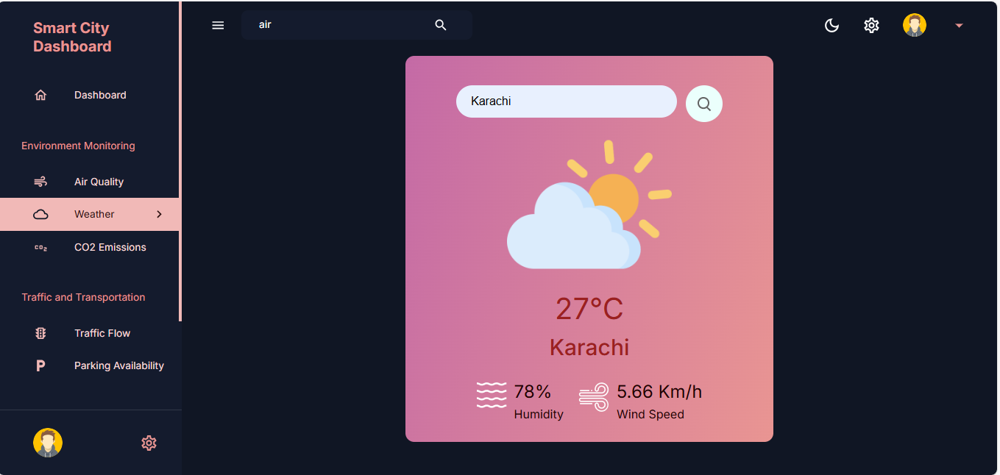

# Smart City Dashboard Project


This comprehensive smart city dashboard project is built using the MERN (MongoDB, Express.js, React, Node.js) stack. It provides a versatile interface for managing and visualizing various aspects of a smart city, including air quality, weather, CO2 emissions, traffic flow, energy consumption, water usage, and parking availability. The dashboard supports light and dark mode themes and is designed to be responsive across different devices.

## Table of Contents

1. [Demo](#demo)
2. [Introduction](#introduction)
3. [Features](#features)
4. [Technologies Used](#technologies-used)
5. [Packages Used](#packages-used)
6. [Installation](#installation)

## Demo

You can see a live demo of the smart city dashboard at [Live Demo](https://react-dashboard12.vercel.app).

## Introduction

This project aims to offer a comprehensive dashboard solution for smart city management using the MERN stack. It provides a user-friendly interface with multiple tabs for handling various aspects of data visualization, including air quality, weather, CO2 emissions, traffic flow, energy consumption, water usage, and parking availability. The frontend is developed with React, integrating various libraries for visual components and data visualization, while the backend utilizes Express.js and MongoDB via Mongoose for data handling.

## Features

### Air Quality
- **Description**: Displays the current Air Quality Index (AQI) along with a status description based on the AQI value.
- 

### Weather
- **Description**: Shows the current weather conditions including temperature, description, humidity, and wind speed.
- 

### CO2 Emissions
- **Description**: Provides a breakdown of CO2 emissions from different sources such as electricity, flights, shipping, and vehicles.
- 

### Traffic Flow
- **Description**: Displays traffic congestion levels, average speed, and incidents on the map.
- 

### Energy Consumption
- **Description**: Breaks down energy consumption by sector and generation type.
- 

### Water Usage
- **Description**: Displays water usage by sector and the availability status.
- 

### Parking Availability
- **Description**: Shows the number of available parking spaces, total spaces, and occupancy rate.
- 

## Technologies Used

### Frontend

- **React**: JavaScript library for building user interfaces.
- **Nivo**: Data visualization library for React.
- **Material-UI (MUI/MUI-X)**: React UI components for modern web applications.
- **React Router DOM**: For client-side routing within the application.
- **Leaflet**: Library for interactive maps.
- **Chart.js**: Library for creating charts.
- **React-Redux**: For state management.

### Backend

- **Node.js**: JavaScript runtime environment for server-side development.
- **Express.js**: Web application framework for Node.js.
- **MongoDB**: NoSQL database for data storage.
- **Mongoose**: Object Data Modeling (ODM) library for MongoDB and Node.js.

### Other Technologies

- **HTML/CSS**: Frontend markup and styling.
- **JavaScript (ES6+)**: Programming language used in both frontend and backend.

## Packages Used

### Client-side

- **@emotion/react**, **@emotion/styled**: For CSS-in-JS styling.
- **@mui/material**, **@mui/icons-material**: Material-UI components and icons.
- **@mui/x-data-grid**: Data grid component for Material-UI.
- **@nivo/bar**, **@nivo/core**, **@nivo/geo**, **@nivo/line**, **@nivo/pie**: Nivo chart components.
- **axios**: For making HTTP requests.
- **chart.js**, **react-chartjs-2**: For charting.
- **leaflet**, **react-leaflet**: For map visualization.
- **react-datepicker**: Datepicker component for React.
- **react-redux**: Official React bindings for Redux state management.
- **react-router-dom**: Declarative routing for React applications.

### Server-side

- **body-parser**: Middleware for parsing incoming request bodies.
- **cors**: Middleware for enabling cross-origin resource sharing.
- **dotenv**: Module for loading environment variables from a .env file into process.env.
- **express**: Web application framework for Node.js.
- **helmet**: Middleware for securing HTTP headers.
- **mongoose**: ODM library for MongoDB and Node.js.
- **morgan**: HTTP request logger middleware for Node.js.
- **nodemon**: Utility for automatically restarting the Node.js server upon file changes.

## Installation

### Environment Variables Setup

#### Client-side Environment Variables

Create a `.env` file in the `client` directory and add the following variable:

```bash
VITE_APP_BASE_URL="http://localhost:5001"


## Getting Started

Follow these steps to set up and run the Smart City Dashboard project locally.

### Prerequisites

- **Node.js**: Ensure Node.js is installed. [Download Node.js](https://nodejs.org/)
- **MongoDB**: Ensure MongoDB is installed and running. You can use a local instance or a cloud-hosted service like [MongoDB Atlas](https://www.mongodb.com/cloud/atlas).

### Setup

1. **Clone the Repository**

   ```bash
   git clone https://github.com/YourUsername/Smart-City-Dashboard.git
   cd Smart-City-Dashboard
